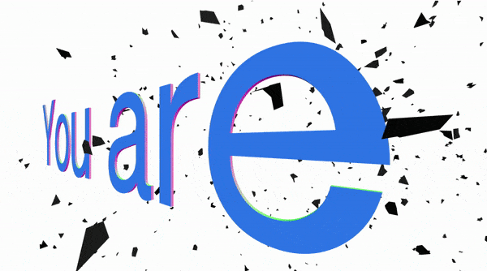
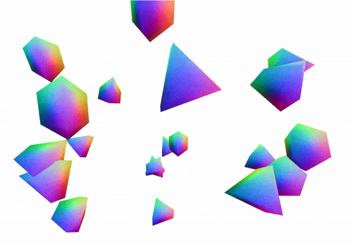
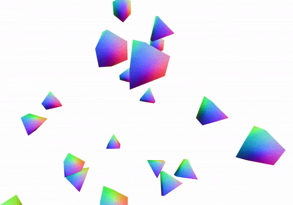
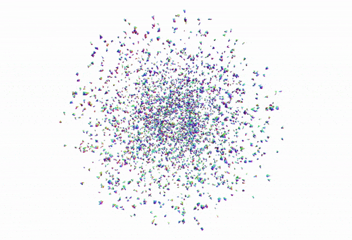

# TASKS

## GENERAL

#### CONCEPT
- We developed different concepts in the beginning. We had the idea of everyone living in their own bubble with their own problems and we all thought about some possible topics. Jack brought up micro aggressions and I suggested focusing on this topic alone (since it is very strong and comprehensive itself) instead of having a lot of big topics that we can't really cover or give justice to.
- From then on we developed it all together and everybody gave their input
- We brainstormed together about the title for weeks until we found one

#### ORGANISATION/ WORK STRUCTURE
- I attended every group meeting, which happened twice a week, so about 28 meetings ranging from 1-5 hours
- I also attended almost every departement meeting
- I would say I played the most active role in our meetings by moderating/ leading them
- I checked the intentions and interests of everyone for the project to clarify the individual tasks (so that everybody is happy with it)

## WEBSITE
- We all searched for other websites as inspiration and moods
- We spent a lot of time on dicussing the website layout and design, the design of the illustrations, and the user interaction
- I gave feedback on the Flos illustrations that Rita had planned
- I learned the basics of react

### Visualisation
- I created the web visualisation for our website. The main tasks were:
  - research on the look of the particles
  - improving performance for web-based particles
  - implementing a smooth animation between phrases to random position in a sphere back the next phrase
  - connecting the database Ellina created (where website user can enter their own phrase) to the visualisation. This took quite a while, figuring out how to pass on data with react between different components

#### How it works:
- I mainly used the libraries three.js and gsap for the functionality

- I first created a text geometry and used it to generate random points within the text geometry
- the random points were then saved in an two dimensional array [phrases][points], so I could iterate through different phrases after each animatin loop

- The final shard shape has a very low poly sphere as a basis:

- By iterating through all vertices of the sphere and translating them by -2, the sphere is moved away from it's origin. So when we rotate the sphere it will orbit around it's origin like this: 

- Additionally I am adding a random value to the vertices, so the shape gets distorted. The random value is also multiplied (by 3) to increase the distortion.

- The last step is animating the shards from a phrase to random points in a sphere and then back to the next phrase saved in the database. I used the library gsap to achieve a smooth animation with an ease function and easy adjustments for timing the animation: 

This is the final result with 2200 particles and connected to the database, where the phrases are saved:

- I created the Interviews page. For that I had to research a bit about different forms of audio player integration as well as making it nicely responsive with all elements (questions, interviewee character image, audio file)

https://ctech-microaggressions.web.app/interviews/

https://ctech-microaggressions.web.app/installation/

- I created the Installation page. It's only a first version with some text and the embedded teaser for now.

## INTERVIEWS
- Rita suggested only using the audio or to alienate the footage in some way and we discussed and brainstormed about it. The idea is to create a less specific image of the interviewee, so the listener can project it onto more people in their enviroment. Another reason for not showing the video of the interviews is the bad zoom quality, since we can't shoot the interviews personallly due to covid-19. So instead each interviewee gets a character assigned (Florian Kempf created them):

- I encouraged everybody to ask around for possible interviewees
- We all discussed possible questions for the individual interviewees as well as the professional organisation
- I defined the [technical setup/ guidline for conducting the interviews ](https://docs.google.com/document/d/1HA190BUDEBigxHGpKLe4tG7bKwOXOTPoK0li0lYYFZQ/edit?usp=sharing)
- I conducted 2 out the 4 interviews we have so far
- I did a first edit of the interview with Aluel. Denise took over editing them in the end
- I suggested putting up the audio file underneath a written question on the website to structure it and have shorter audio files as a result

## INSTALLATION
- We all added moods for the installation setup
- Rita and I brainstormed a lot about setup, projection, user experience
- I looked up the studio layout and size, as well as communicating with Sehsüchte (GeKo)
- Rita and I made two projection tests on white sheets. I took photos and videos of it and edited them. The first test was just for trying it out and getting some feedback. The second test was for the installation teaser, which I shot and edited (Denise helped me with the sound file).
- I also built a miniature installation with Rita and Denise. We used small wooden skewers, a 3D pen and tissues to create the structure. I took photos and videos of it also for the teaser and photo material.
Here are some behind the scenes of the teaser:

 

And the teaser link: [REMNANTS | kind acts of cruelty | Teaser](https://vimeo.com/509402966) 

## VISUALISATION
- We all added moods for the visualisation to the miro board
- Zainab was in charge of the visualisation. I gave her my opinion on the results, especially regarding the visual shape, particle coount, particle movement

## SOUND
- I added some moods for the "nice" atmospheric sounds as well as the "not so nice" sounds to the miro board 
- I attended most of the sound meetings with Julia and Felix, who created the sound design
- We discussed topics like the length and the suspense curve of the audio, using headphones or speakers, the mood it should portray,.. 
- I gave feedback to their results

## CONTENT
- I wasn't part of creating the text content for the website, but I proofread it
- I educated myself more about the topic and talked to a lot of friends about it

# Conclusion
I think this is one of the best group projects I've ever been apart of. The flat hierarchy worked extremly well. I sort of took the lead in managing all of our meetings and generally taking the producer role, but it wasn't such a big role since we had a captain for each departement anyways. Everybody was in charge of a departement, so the responsibility was clear and well distributed. However, one could still be part of any team to share their opinion without having to actively work on it. So for example I was on the sound team, where I looked up sound moods and expressed my thoughts, but I dindn't create the actual sound design. This way everyone felt very integrated in what interests them about the project. 
