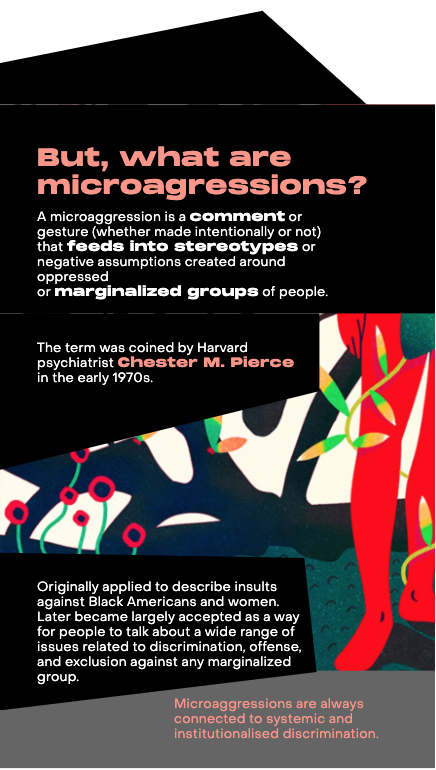
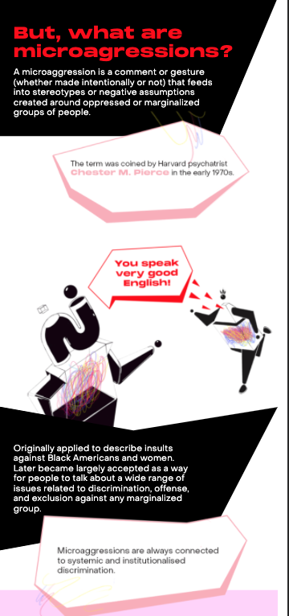
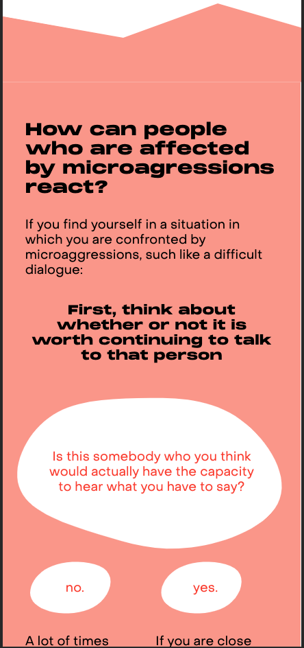
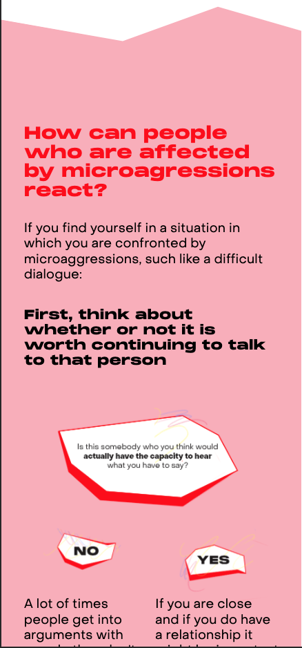
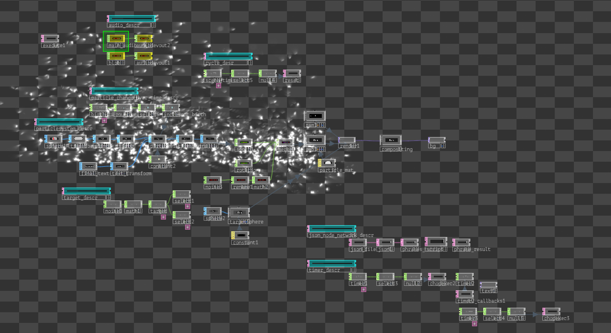

# TASKS

## GENERAL

### CONCEPT
In the beginning we brainstormed together. We collected ideas related to the topic ignite. Everyone gave their input and from the very beginning Since this topic was it was clear that we wanted to tackle social issues as the main topic of the project. The first concept we developed was related to everyone living in their own bubble. We wanted to present it as an installation consisting of interactive bubble like structures. Since this is a very broad topic we thoght of narrowing it down and Jack presented the idea of micro-agressions and we decided to focus on that. We brainstromed further regarding every aspect of the project, e.g visulaisation, website, sound etc. together. 
We spent quite some time coming up with a title. I suggested remnants because it suited to the project and to micro-agressions, because when someone experiences some sort of micro-agression there is always a remainder left in the memory. 

### ORGANISATION/ WORK STRUCTURE
- Once our concept was clear. We formed different teams for focusing on different parts of the project. 
- Every team had a team captain. The captain was responsible for oranganization within the team, for instance coming up with a milestone plan, organizing meeting etc. I was the team captain for visualization. 

## WEBSITE
- Everyone looked up different websites for inspiration regarding the mood, design and interaction. 
- Everyone gave their input on the design of the website but Rita was responsible for designing the website.
- I worked on the front-end of 2 sections (definition and reaction). I learned the basics of react, and about different layout systems in Css, e.g flexbox, grid-layout. 

  

  

## INTERVIEWS
- I wasn't part of the Interview team. But I went through the recordings of the interview and gave my review.

## INSTALLATION
- We looked up for different possibilities of physically presenting our project. 
- Everyone added differnt moods for the installation.
- Everyone gave their input about the walkthrough of the installation (user experience).
- Once the sketches for the projection structure. Everyone reviewed it together.

## VISUALISATION
- I was the team captain for visualisation. 
- At first everyone added moods for the visuals. We decided on the main visuals, which would look like a swarm.
- I made a milestone plan for the visuals. At first we thought of using the same visuals for the website and the installation.
- That why I decided to implement it in Unity using the VFX graph. During the development we decided that the website visuals will be different than the installation. 
- I learned the basics of vfx graph but using unity for implementing the visuals posed a few problems, e.g for forming phrases with particles. The text had to be a 3D model with sdf and it was performance heavy, so I decided to switch to TouchDesigner. 
- I implemented all the properties regarding the visualisation in Touchdesigner, e.g particle system, shape of particles, compositing, parsing Json data forming phrases, timing etc. 
- I only knew the basics of Touchdesigner. I improved my knowledge in using different functionalities of Tocudesigner. I learned about scripting in python, using differnt operators for different funtionalities, using timers, using different maths operators. I also learned about parsing Json data in python. 

 

 

## SOUND
- I attended the meetings with Julia and Felix (who created the sound design) and gave my feedback. We discussed about certain properties of the sound, e.g if it should be interactive, length of the audio, the feeling it should convey, the overall structure of the audio etc.
- I integrated the sound to the visualization.

## CONTENT
- I wasn't part of the team but I proofread the website content.
- I watched videos and read articles on the topic.

# Conclusion
This was the biggest university project (scope-wise) I worked on in a team. The organisation was super effective. Every team was efficient and even though you were not a memeber of a specific, team you could still give your input. All the meeting were productive. One drawback of having the meetings on zoom was that it was more exhausting compared to meetings in person. Overall I learned a lot about not only the topic but also about developing a project from conceptualisation to implementation.
