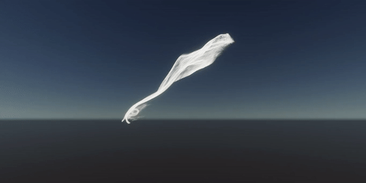
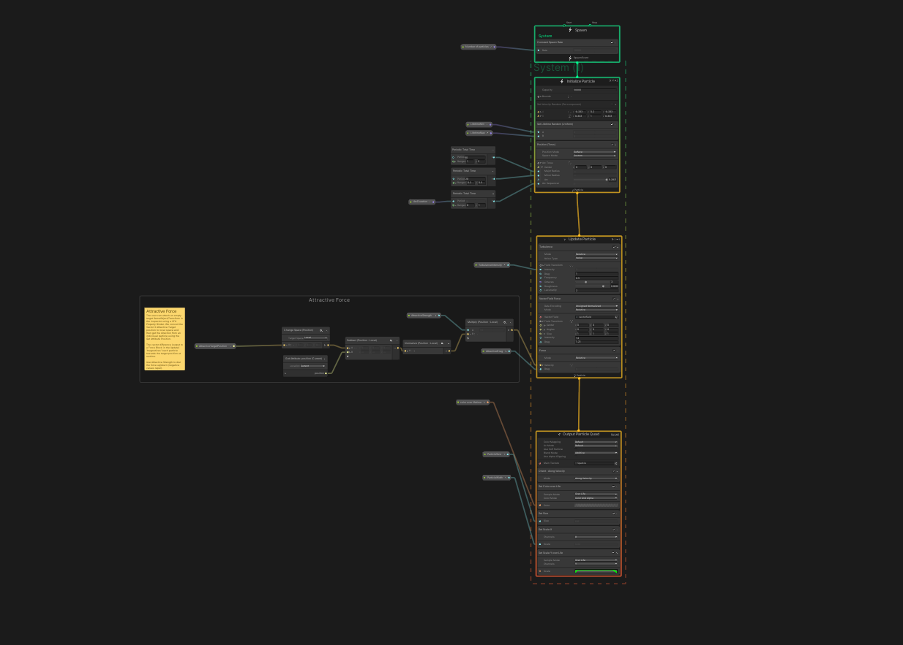

# Visualisation_Documentation

### 04 - 07 December 2020 

- Followed VFX graph [tutorials](https://youtu.be/keVozyJAIUM)
- First visualisation test
- Particles follow a Target GameObject that can be moved 

### to do:
- Change color to black
- Read Json file
- Particle Number depends on the number of Phrases/words
- Particle form phrases 
- Change exposed VFX graph node values through script
- Scripting in VFX graph 

First results: 

